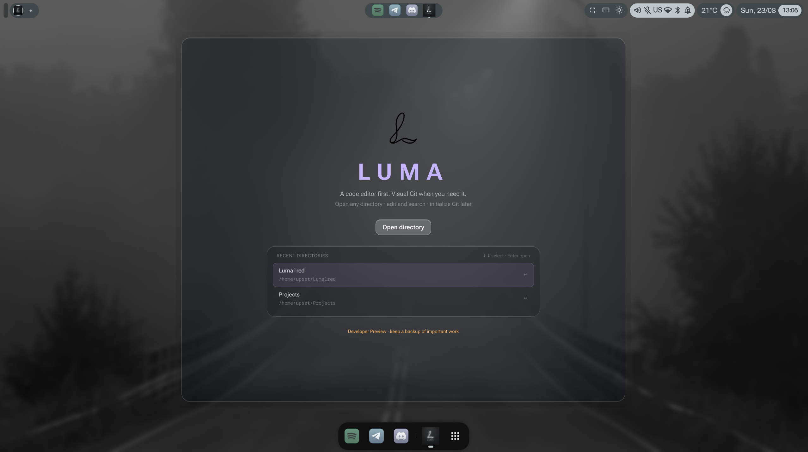
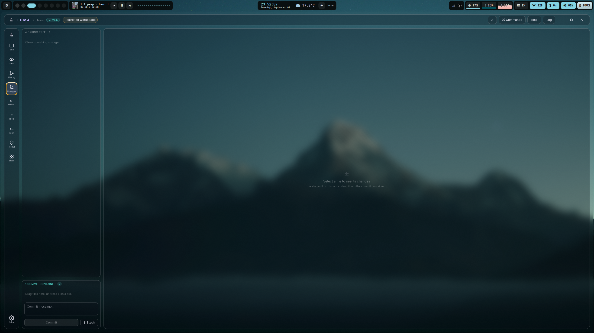
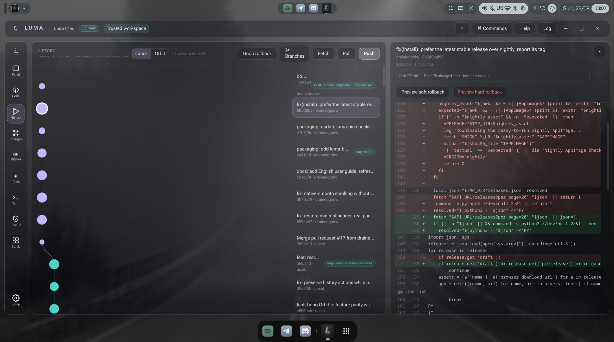
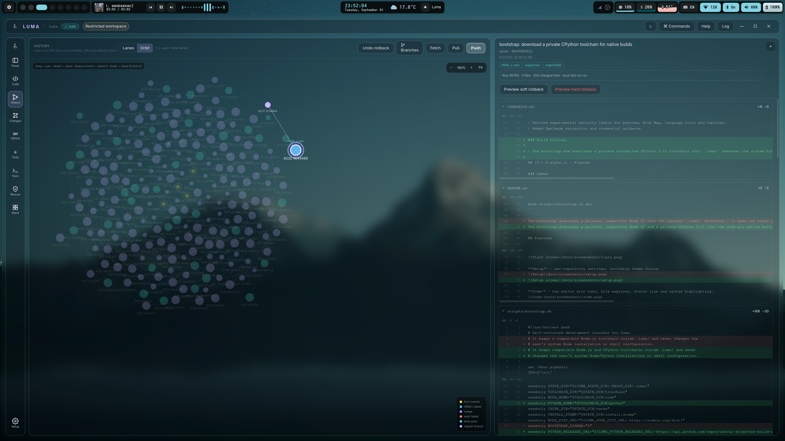
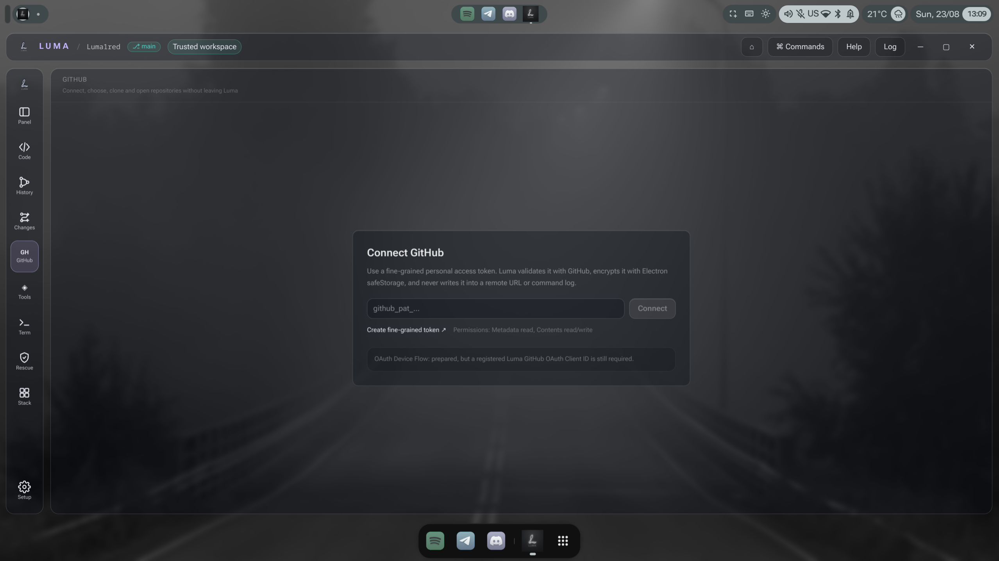
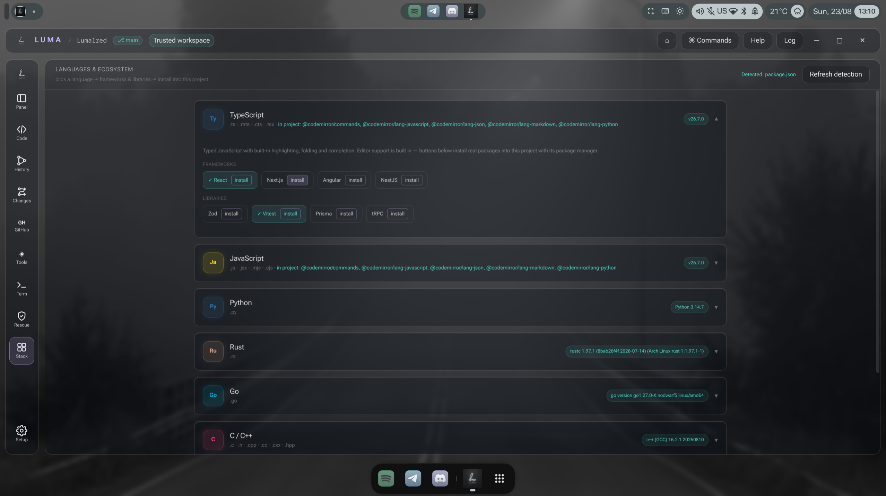

<div align="center">


# Luma

**See what Git will do before it does it.**

A Linux-first visual Git workspace: understandable history, previewable operations, and recovery from mistakes.

  

</div>

> [!WARNING]
> Luma 0.1 is a developer preview. Keep a remote backup and begin with non-critical repositories.

## Why Luma?

Most IDEs treat Git as a sidebar. Luma treats history as the workspace itself: inspect commits in a visual web, preview a rewrite before applying it, and keep a recovery point before moving HEAD.

## Install

One command — installs to `~/.local`, adds Luma to your application menu, no Node.js needed:

```sh
bash -c "$(curl -fsSL https://raw.githubusercontent.com/drainedgodw/Luma/main/install.sh)"
```

Run it again to update. Remove with `-- --uninstall` (keep settings) or `-- --purge` (remove everything).

Manual download is also available from [GitHub Releases](https://github.com/drainedgodw/Luma/releases) — verify the published SHA-256 checksum.

### From source

```sh
git clone https://github.com/drainedgodw/Luma.git
cd Luma
bash scripts/bootstrap.sh dev
```

The bootstrap downloads a private, compatible Node 22 and a private CPython 3.11 (for the node-pty native build) into the ignored `.luma/` directory — it does not touch your system Node, Python or shell config. See `bash scripts/bootstrap.sh --help` for test/build/clean commands.

## Features

- **History** — commit graph in two views: classic Lanes and an interactive Orbit web (drag to pan, wheel to zoom)
- **Changes** — staging by drag & drop, diffs, conflict resolution, commit messages with a template history
- **Visual rebase** — reorder, squash, fixup, reword and drop commits; cherry-pick, revert, tags, merge strategy choice
- **Safety net** — Secret Guard scans staged additions, every rollback creates a checkpoint branch, Rescue browses the reflog, bisect and stash included
- **Editor** — CodeMirror 6 with syntax highlighting for 8 languages, tabs, find & replace, project-wide search (Ctrl+Shift+F), quick open (Ctrl+P)
- **Terminal** — integrated terminal, unlocked per repository via Workspace Trust
- **GitHub** — fine-grained PAT or SSH keys, clone, fetch, pull, push; the token is encrypted and never stored in plain text
- **Languages & Ecosystem** — detects runtimes and project dependencies, installs packages and frameworks with a whitelisted command set
- **Two themes** — Cosmos and Liquid Glass

## Keyboard

- Ctrl + `P` — quick open file
- Ctrl + `F` — find in editor / search workspace
- Ctrl + Shift + `F` — search across the project
- Ctrl + Shift + `P` — command palette
- Ctrl + `B` — pin/auto-hide Explorer
- Ctrl + `` ` `` — terminal

Full walkthrough: [docs/USERGUIDE.md](docs/USERGUIDE.md).

## Screenshots

**Start** — directory picker with recent folders and keyboard navigation. Luma is an IDE first: any folder opens, Git is optional.


**Setup** — per-repository settings, including theme choice.


**Code** — the editor with tabs, file explorer, status line and syntax highlighting.


**Changes** — unstaged/staged files, drag & drop staging, diff view and commit box.


**History — Lanes** — the classic commit graph with branch lanes, commit details and actions.


**History — Orbit** — the same history as an Obsidian-style web of commits; drag to pan, wheel to zoom, drag a commit to place it.


**GitHub** — connect a token or SSH key, then clone, fetch, pull and push without leaving the app.


**Tools** — bisect, stash, reflog Rescue and other recovery operations in one place.


**Stack (Languages & Ecosystem)** — detected runtimes, project dependencies and one-click installs of packages and frameworks.


**Rescue** — reflog browser: every move of HEAD is recoverable, with checkpoint branches from rollbacks.


## Project structure

```text
src/main/       Electron process, Git, terminal, trust and filesystem services
src/preload/    typed and allowlisted IPC bridge
src/renderer/   React UI, editor and visual Git workflows
src/shared/     shared types and graph layout
tests/          parser, Git integration, security and recovery tests
```

## Reporting problems

- Security issue: follow [SECURITY.md](SECURITY.md); do not open a public exploit report.
- Bug or feature proposal: open a GitHub issue with OS, display server, Git version, reproduction steps and logs with secrets removed.
- Quick feedback or questions: ping the author on Telegram — [@upsetsay](https://t.me/upsetsay).
- Contribution: read [CONTRIBUTING.md](CONTRIBUTING.md).
- Changes: see [CHANGELOG.md](CHANGELOG.md).

## License

[MIT](LICENSE)
